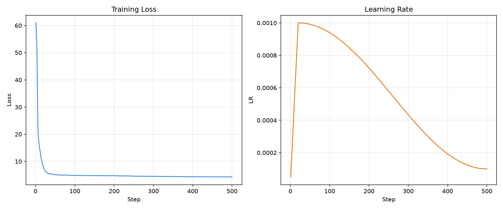

# Tetra — Pure Ternary LLM

**Tetra** is a decoder-only transformer trained entirely with **ternary weights** ({-1, 0, +1}). Three training modes:

- **STE** (Straight-Through Estimator) — FP32 latent shadow weights quantized on-the-fly via absmean, gradient flows through STE. (BitNet b1.58 approach)
- **Stochastic Bit-Flip** — no latent weights. Weights stored as packed 2-bit ternary. Gradient sign accumulated in FP32 accumulator; weight flips when |accumulator| > threshold.
- **Hybrid SSM-Attention** — 80% Ternary SSM (Mamba-style) + 20% Ternary Attention layers. SSM scan via vectorized parallel prefix (O(T), no Python loop).

## Architecture

Base BitNet b1.58-style transformer, optionally hybridized:

| Component | STE / Stochastic | Hybrid |
|-----------|-----------------|--------|
| **Weights** | {-1, 0, +1} via absmean (STE) or packed 2-bit (Stochastic) | Same per-layer |
| **Attention** | Causal multi-head, KV cache, ternary Q/K/V/O projections | 20% of layers |
| **SSM Block** | — | 80% of layers: RMSNorm → TernaryLinear(expand 2×) → depthwise Conv1d → SiLU → parallel-prefix SSM scan → gate → TernaryLinear(project back) |
| **FFN** | SwiGLU: fused gate+up into one ternary matmul (2× FFN dim) | Same |
| **Sparsification** | Optional `--topk RATIO`: keep top-k% activations after norm, zero rest (STE backward) | Same |
| **INT8 Forward** | Optional `--int8`: quantize activations → int8 before matmul (QAT effect) | Same |
| **Normalization** | Pre-norm RMSNorm (always FP32 internally) | Same |
| **Tokenizer** | Custom BPE (default, vocab=8192) or GPT-2 (`--tokenizer-dir gpt2`, vocab=50257) | Same |

Key design decisions:
- **Attention & FFN compute in FP32** for numerical stability (q/k/v cast to fp32 before `scaled_dot_product_attention`, SwiGLU hidden cast to fp32 before down-projection). Avoids float16 overflow on large hidden dims.
- **`activation_dtype`** used instead of `torch.amp.autocast` for explicit control over precision.
- **RMSNorm always runs in FP32** regardless of activation dtype.

## Presets

| Preset | Params | Ternary | Non-ternary | hidden_dim | layers | heads | ffn_dim | Head dim |
|--------|--------|---------|-------------|------------|--------|-------|---------|----------|
| **tiny** | 8.5M | 6.3M | 2.2M | 256 | 6 | 8 | 1024 | 32 |
| **medium** | 54.6M | 53.9M | 660K | 512 | 12 | 8 | 2048 | 64 |
| **large** | 91.3M | 90.6M | 720K | 768 | 12 | 12 | 2048 | 64 |
| **500m** | 516M | 494M | 22M | 2560 | 6 | 40 | 6826 | 64 |

## Quick Start

```bash
# Train tiny on TinyStories (auto-downloads if missing)
python train.py --preset tiny --steps 5000 --dtype float16

# Use GPT-2 tokenizer instead of custom BPE
python train.py --preset tiny --steps 5000 --dtype float16 --tokenizer-dir gpt2

# Multi-source data (1B tokens from FineWeb/Cosmopedia/Orca)
python scripts/prepare_data.py --data-cache data
python train.py --preset 500m --steps 15000 --dtype float16 --data-cache data --batch-size 4 --grad-accum 8
```

## Mixed Precision

Manual `activation_dtype` casting (no `autocast`):

| `--dtype` | CUDA | DirectML | CPU |
|-----------|------|----------|-----|
| `float16` | activation_dtype=fp16 + GradScaler | activation_dtype=fp16 | — |
| `bfloat16` | activation_dtype=bf16 (if supported) | falls back to fp32 | — |
| `float32` | full fp32 | full fp32 | full fp32 |

On CUDA, GradScaler is active for float16. Attention q/k/v and FFN SwiGLU hidden are cast to FP32 before compute to prevent overflow.

## Data

- **TinyStories** (default, auto-download): ~535M tokens, simple children stories. Ideal for small models.
- **Multi-source** (FineWeb 50% + Cosmopedia 30% + Orca 20%): ~1B tokens, GPT-2 tokenizer. For 500M+ models.
- **Tokenizer**: Custom BPE (vocab=8192, trained on TinyStories) by default. GPT-2 (vocab=50257) via `--tokenizer-dir gpt2`.

## C++ Extension

SIMD-accelerated pack/unpack:

```bash
python build_cpp.py
```

Requires MSVC (Visual Studio 2022). Auto-loaded at runtime; falls back to Python if not built.

## Examples

### Tiny 8.5M on TinyStories

Trained for 5,000 steps on Intel Iris Xe (DirectML) in ~3 hours:

| Metric | Value |
|--------|-------|
| **Total params** | 8,523,008 (6.3M ternary + 2.2M FP32) |
| **Dataset** | TinyStoriesV2-GPT4, 535M tokens, 267K stories |
| **Tokenizer** | Custom BPE, vocab=8192 |
| **Mode** | STE (latent weights) |
| **Batch** | 16 × 4 grad_accum = 64 effective |
| **Speed** | 2.26s/step |
| **Final train loss** | 4.3092 |
| **Final val loss** | 4.3182 |
| **Loss trend** | 60.96 → 4.31 (converged smoothly) |

<p align="center">
  
  <br>
  <em><b>Figure 1:</b> Convergence curve of Tetra 8.5M (STE) on TinyStories (5,000 steps, Cosine LR Decay with Warmup).</em>
</p>

Sample output after training:
> "Hello , Tim to find food the ball like . " I can help he . You mom said . He is . We ' s . You you !" Sue ' s room and a tree away . She is . " Let . He likes . She says . It is . She had and said need the bear and they played too . They were best , Tim and she were very happy on the bird . They went the ground , Tom smiled and laughed away him they could . The cat . The bird ' s a nice . They looked . They played all lived . But then it . <| endoftext |> Once upon a time , there was a little boy named Tim . The truck was very the rock . One day , she saw what . The boat and said , she could , " Thank said , Tim . He found it !" The bird to play with his mom , " Can you something and said , " Maybe to play . The end . She saw a big , he wanted to find to his family the hole"

Limited but coherent — expected for 8.5M params on simple stories.


## Project Structure

```
train.py                    # Main entry point

scripts/
  benchmark_speed.py        # Speed benchmark across presets
  prepare_data.py           # Stream data from HF → tokenized chunks
  train_tokenizer.py        # Train BPE tokenizer on TinyStories

ternary_llm/
  quantization.py           # STE + Stochastic Bit-Flip autograd functions, pack/unpack
  layers.py                 # TernaryLinear, StochasticTernaryLinear, RMSNorm, TopKActivation
  attention.py              # MultiHeadAttention with KV cache
  ffn.py                    # SwiGLU FFN: fused gate_up_proj (2×FFN dim)
  ssm.py                    # Ternary SSM block (parallel-prefix scan)
  hybrid.py                 # Hybrid SSM-Attention transformer model
  transformer.py            # Full model, generate with KV cache, sample
  data.py                   # ChunkedDataset, MultiSourceChunkedDataset
  trainer.py                # TernaryTrainer + DMLAdamW
  int8.py                   # INT8 fake-quantization
  csrc/
    ternary_ops_avx2.cpp    # C++ SIMD pack/unpack (AVX2)
    ternary_ops_avx512.cpp  # C++ SIMD pack/unpack (AVX-512)
    setup.py                # PyTorch extension build

inference/
  tetra.h / tetra.cpp       # C++ inference engine
  export_model.py           # Checkpoint → binary format
  run_inference.py          # Python wrapper around C++ inference
  benchmark_ppl.py          # Perplexity measurement
  build.bat                 # MSVC build script

tests/
  test_quantization.py
  test_layers.py
  test_transformer.py
  test_prototype.py
  test_convergence.py
```