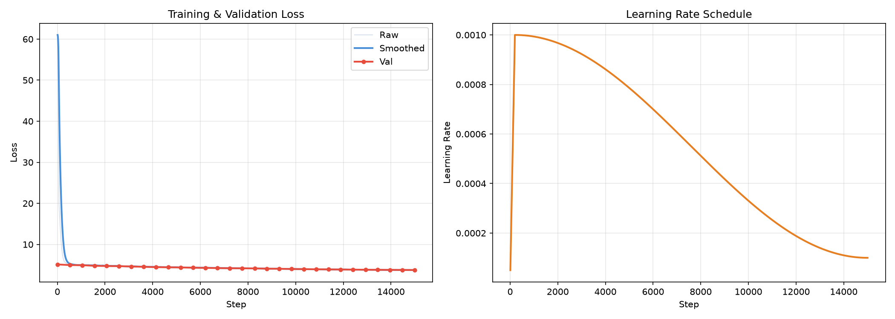
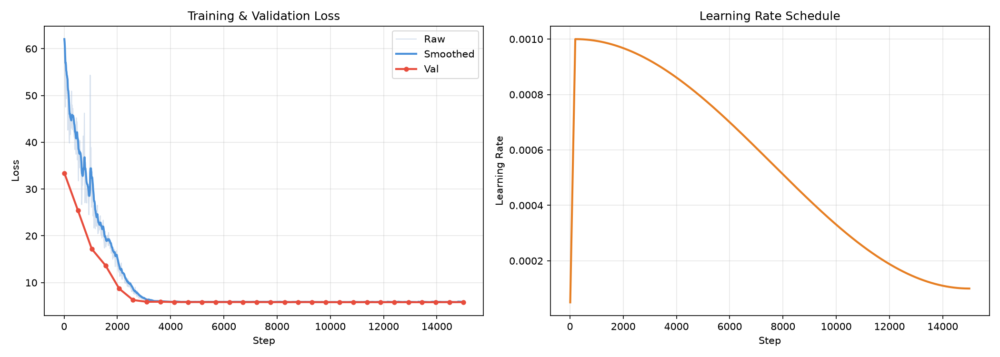

<p align="center">
  
</p>

<h1 align="center">Tetra - Pure Ternary LLM</h1>

**Tetra** is a decoder-only transformer trained entirely with **ternary weights** ({-1, 0, +1}) and exported to a **3.6 MB C++ binary** that runs at **300+ tok/s** on CPU (AVX2).

Three training modes:

- **STE** (Straight-Through Estimator) — FP32 latent shadow weights quantized on-the-fly via absmean, gradient flows through STE. (BitNet b1.58 approach)
- **Stochastic Bit-Flip** — no latent weights. Weights stored as packed 2-bit ternary. Gradient sign accumulated in FP32 accumulator; weight flips when |accumulator| > threshold. Supports cosine threshold decay (`--threshold-decay-to`), per-channel scaling (`--per-channel`), and per-group block scaling (`--group-size N`).
- **Hybrid SSM-Attention** — 80% Ternary SSM (Mamba-style) + 20% Ternary Attention layers. SSM scan via vectorized parallel prefix (O(T), no Python loop). **Experimental — training runs exhibit loss explosions (unstable); not production-ready.**

Plus **Multi-head Latent Attention (MLA)** — DeepSeek-V2-style KV compression for attention. Compresses K,V into a small latent vector (`--kv-latent-dim`, default 64) before caching, reducing KV cache by 4×. Uses decoupled RoPE with separate per-head Q/K rope projections (`--rope-per-head`, default 8). Compatible with Stochastic Bit-Flip mode (`--mla` flag). **Untested — implemented (Python + C++ loader) but not yet validated in a training run.**

## Architecture

Base BitNet b1.58-style transformer, optionally hybridized:

| Component | STE / Stochastic | Hybrid | MLA |
|-----------|-----------------|--------|-----|
| **Weights** | {-1, 0, +1} via absmean (STE) or packed 2-bit (Stochastic). Optional per-channel or per-group scaling alpha. Per-group: `--group-size N` splits `in_features` into blocks of N, each with its own alpha. | Same per-layer | Same |
| **Attention** | Causal multi-head, KV cache, ternary Q/K/V/O projections | 20% of layers | MLA (untested): K,V compressed to latent (default 64-dim), decoupled RoPE (default 8-dim/head). 7 ternary projections: q, kv_down, k_up, v_up, q_rope, k_rope, o. KV cache reduced 4×. |
| **SSM Block** | — | 80% of layers: RMSNorm → TernaryLinear(expand 2×) → depthwise Conv1d → SiLU → parallel-prefix SSM scan → gate → TernaryLinear(project back) — loss explosion observed in training | — |
| **FFN** | SwiGLU: fused gate+up into one ternary matmul (2× FFN dim) | Same | Same |
| **Sparsification** | Optional `--topk RATIO`: keep top-k% activations after norm, zero rest (STE backward) | Same | Same |
| **INT8 Forward** | Optional `--int8`: quantize activations → int8 before matmul (QAT effect) | Same | Same |
| **Normalization** | Pre-norm RMSNorm (always FP32 internally) | Same | Same |
| **Tokenizer** | Custom BPE (default, vocab=8192) or GPT-2 (`--tokenizer-dir gpt2`, vocab=50257) | Same | Same |

Key design decisions:
- **Attention & FFN compute in FP32** for numerical stability (q/k/v cast to fp32 before `scaled_dot_product_attention`, SwiGLU hidden cast to fp32 before down-projection). Avoids float16 overflow on large hidden dims.
- **`activation_dtype`** used instead of `torch.amp.autocast` for explicit control over precision.
- **RMSNorm always runs in FP32** regardless of activation dtype.

## Presets

| Preset | Params | Ternary | Non-ternary | hidden_dim | layers | heads | ffn_dim | Head dim |
|--------|--------|---------|-------------|------------|--------|-------|---------|----------|
| **tiny** | 8.5M | 6.3M | 2.2M | 256 | 6 | 8 | 1024 | 32 |
| **medium** | 54.6M | 53.9M | 660K | 512 | 12 | 8 | 2048 | 64 |
| **large** | 91.3M | 90.6M | 720K | 768 | 12 | 12 | 2048 | 64 |
| **500m** | 516M | 494M | 22M | 2560 | 6 | 40 | 6826 | 64 |

## Quick Start

```bash
# Train tiny on TinyStories (auto-downloads if missing)
python train.py --preset tiny --steps 15000 --dtype float16 --graph

# Resume from latest checkpoint + plot full history
python train.py --preset tiny --steps 30000 --dtype float16 --graph --resume

# Train with Multi-head Latent Attention (MLA, DeepSeek-V2 style) — untested, experimental
python train.py --preset tiny --steps 15000 --dtype float16 --graph --mla --kv-latent-dim 64 --rope-per-head 8

# Export to C++ binary and run inference
python inference/export_model.py checkpoints/checkpoint_015000.pt inference/tetra_model.bin
cd inference && build.bat avx2 && cd ..
python inference/run_inference.py inference/tetra_model.bin "Once upon a time" --max-tokens 100 --repeat-penalty 1.1

# Use GPT-2 tokenizer instead of custom BPE
python train.py --preset tiny --steps 15000 --dtype float16 --tokenizer-dir gpt2

# Multi-source data (1B tokens from FineWeb/Cosmopedia/Orca)
python scripts/prepare_data.py --target-tokens 1e9
python train.py --preset 500m --steps 15000 --dtype float16 --data-cache data --batch-size 4 --grad-accum 8
```

## Mixed Precision

Manual `activation_dtype` casting (no `autocast`):

| `--dtype` | CUDA | DirectML | CPU |
|-----------|------|----------|-----|
| `float16` | activation_dtype=fp16 + GradScaler | activation_dtype=fp16 | — |
| `bfloat16` | activation_dtype=bf16 (if supported) | falls back to fp32 | — |
| `float32` | full fp32 | full fp32 | full fp32 |

On CUDA, GradScaler is active for float16. Attention q/k/v and FFN SwiGLU hidden are cast to FP32 before compute to prevent overflow.

## Data

- **TinyStories** (default, auto-download): ~535M tokens, simple children stories. Ideal for small models.
- **Multi-source** (FineWeb 50% + Cosmopedia 30% + Orca 20%): ~1B tokens, GPT-2 tokenizer. For 500M+ models.
- **Tokenizer**: Custom BPE (vocab=8192, trained on TinyStories) by default. GPT-2 (vocab=50257) via `--tokenizer-dir gpt2`.

## C++ Inference Engine

Pure C++17 inference engine (`inference/tetra.h`, no dependencies):

| Feature | Detail |
|---------|--------|
| **File size** | 3.6 MB (ternary weights 2-bit packed, embeddings INT8 quantized) |
| **Speed** | 300+ tok/s (AVX2, CPU), 80+ tok/s (scalar) |
| **MLA** | Full MLA decode + prefill with KV latent compression, decoupled RoPE, and K/V reconstruction from cached latents (model-side untested end-to-end) |
| **Prefill** | Parallel batch prefill — all prompt tokens in one forward pass (OpenMP) |
| **Sampling** | Top-k + top-p + temperature + repetition penalty, matches PyTorch order |
| **Build (Windows)** | `build.bat avx2` (auto-detects VS via vswhere, enables `/openmp`) |
| **Build (Linux)** | `build.sh avx2` (requires g++ with OpenMP) |

### Export & Run

```bash
python inference/export_model.py checkpoints/checkpoint_*.pt inference/tetra_model.bin

# Windows
cd inference && build.bat avx2
tetra_avx2.exe tetra_model.bin "373,378,67,338" 100 0.8 50 0.9 1.0

# Linux
cd inference && bash build.sh avx2
./tetra_avx2 tetra_model.bin "373,378,67,338" 100 0.8 50 0.9 1.0

# Or via Python with tokenizer (cross-platform)
python run_inference.py tetra_model.bin "Once upon a time" --max-tokens 100
```

### Binary Format (v4–v7)

Base binary layout, shared by all versions (v5+ adds extended header fields, v6/v7 deltas documented under Discrete Learning):

| Section | Encoding |
|---------|----------|
| Header (64B) | magic `TETR`, version, dims, param counts (v5+: flags, kv_latent_dim, rope_per_head, group_size) |
| Ternary weights | name (suffix `.latent_weights`), shape, `group_size(2B)` + `num_alphas(2B)` + `alphas(N×4B)`, 2-bit packed (4 weights/byte). `group_size=0` → per-channel or scalar (v3 compat). MLA auto-detected from tensor names containing `kv_down_proj`. |
| FP32/INT8 weights | name, shape, dtype byte: `0`=FP32, `1`=INT8 + scale |
| Embeddings | INT8 (token 8K×256→2.0 MB, pos 512×256→0.13 MB) |
| Norms | FP32 (tiny, ~12 KB) |

Version deltas: **v6** = +FP32 accumulator per ternary entry + SL metadata (below). **v7** = +outlier side-channel blobs (code 11 = ±2, below).

Three alpha modes controlled by `group_size` and `num_alphas`:

| Mode | `group_size` | `num_alphas` | Storage |
|------|-------------|-------------|---------|
| Scalar | 0 | 0 | default `alpha=1.0`, no extra bytes |
| Per-channel | 0 | rows | `rows × 4B` |
| Per-group | >0 | rows × ceil(cols/group_size) | `rows × ceil(cols/group_size) × 4B` |

Per-group (`--group-size N`): each output row is split into blocks of N dims, each block having its own FP32 alpha. Overhead: with `group_size=64` (tiny 256-dim) adds ~770 KB.

## Vulkan Compute Engine (`inference/vulkan/`)

A Vulkan compute port of the same forward pass for **on-device/GPU inference and self-learning** on the v6 binary format. Runs on Intel Iris Xe (DirectML-style iGPU) with host-visible coherent buffers (UMA). Zero Vulkan dependencies beyond the SDK loader — no Vulkan-Hpp, no glslang at runtime (SPIR-V precompiled via `glslc`).

| Feature | Detail |
|---------|--------|
| **Shaders** | 11 compute shaders (`shaders/*.comp`): embed, rmsnorm, two-stage matmul (mm_partial 4-way column split + mm_reduce), causal attention (one 32-lane workgroup per head, shared-memory score softmax), SiLU, residual add, K/V cache store, plus SL: capture (activation history), rulec (predictive-coding grads), embgrad (tied-embedding grads) |
| **Matmul** | 4 workgroups/row over 64 lanes → partial sums in a scratch buffer → reduce kernel; dispatch X=4 splits × Y=rows; dequantized FP32 ternary weights (25.2 MB) + embedding-as-LM-head in one buffer |
| **KV cache** | Dedicated buffers (`L×seq×H`), zeroed by host at seq boundaries |
| **Parity** | CE identical to C++/PyTorch (6.7661 @128 pos, 6.9383 @1000 pos — exact match) |
| **Speed** | ~708 ms/block (128 tokens) on Intel Iris Xe — **~15% faster than the PyTorch CPU baseline (831.7 ms) and ~20% faster than C++ AVX2 (~900 ms)** |
| **Build (Windows)** | `build_vulkan.bat` (auto-detects VS via vswhere; requires `VULKAN_SDK`, compiles shaders with `glslc` + links `vulkan-1.lib`) |

Modes:

```bash
vulkan_forward.exe <model.bin> <tokens.bin> --eval [max_positions]   # avg CE, same math as selflearn --eval
vulkan_forward.exe <model.bin> <tokens.bin> --bench N                # fresh-cache 128-token blocks, ms/block
vulkan_forward.exe <model.bin> <tokens.bin> --dbg N                  # layer-by-layer intermediate dumps (parity debug)
vulkan_forward.exe <model.bin> <tokens.bin> --sl <out.bin> [steps] [log_every] [save_every] \
       [thr] [decay] [flip_every] [toggle] [--toggle-window N] [--thr-anneal RATE]
       # rule-'c' self-learning loop, same args + update math as selflearn.exe
```

Implementation notes:
- **Memory ordering**: cross-kernel dependencies on the shared partial buffer and act buffer require explicit `VkMemoryBarrier`s (TRANSFER|COMPUTE → COMPUTE) after every fill/dispatch — without them the iGPU driver races adjacent kernels (intermittently-zero matmul outputs). The SL capture stores need no barrier: history is only read by the grad kernels in a later command buffer (queue-idle sync).
- **Numerics**: exact FP32 paths, no FMA contraction between engines; CE parity with C++ and PyTorch on the same token slices.
- **SL loop**: per-position activations are captured into a 21.6 MB history buffer (3 new shaders: `capture`, `rulec`, `embgrad`); block gradients are computed GPU-side in a single command buffer, then bulk-copied to host RAM for the accumulator feed / bit flips / embedding SGD (scattered reads from the coherent mapping run at ~100 ns/element, so a one-shot memcpy staging is 4× faster).

Self-learning parity (vs `selflearn_avx2.exe`, 100-block toggle run):
- CE trajectory matches to 4 decimals for the first 24 blocks (bit-exact to ulp-level rounding); first toggle kick lands on block 25 in both engines.
- Kick schedule identical across all 500 blocks (every 5 blocks), flip counts within 0.2–8.7% per kick.
- After the first mass-kick the per-block CEs diverge chaotically (mean abs diff 0.85) — ulp-level matmul summation-order differences (AVX2 8-lane FMA chains vs 4-way GPU split) get amplified through flip decisions; both engines converge to the same statistical regime (held-out CE ~9.2–9.9 after 500 toggle blocks, finding #12).
- Speed: ~0.81 s/block vs C++ 0.74 s/block (forward alone is ~15% faster on the GPU).

Reproduce the parity + benchmark:

```bash
cd inference/vulkan && build_vulkan.bat
# C++ reference CE
..\selflearn_avx2.exe --eval ..\..\checkpoints_discrete_c3\exp_tog_s0_zacc.bin ..\..\examples\discrete\slice100k.bin 1000
# Vulkan CE + timing
vulkan_forward.exe ..\..\checkpoints_discrete_c3\exp_tog_s0_zacc.bin ..\..\examples\discrete\slice100k.bin --eval 1000
vulkan_forward.exe ..\..\checkpoints_discrete_c3\exp_tog_s0_zacc.bin ..\..\examples\discrete\slice100k.bin --bench 5
# PyTorch CPU baseline
python ..\bench_torch.py ..\..\checkpoints_discrete_c3\exp_tog_s0_zacc.bin
# SL loop parity: 20 toggle-free blocks, same trajectory as selflearn.exe
vulkan_forward.exe ..\..\checkpoints_discrete_c3\exp_tog_s0_zacc.bin ..\..\examples\discrete\slice100k.bin --sl sl_vk.bin 20 1 0 20 0.99 5 0
..\selflearn_avx2.exe ..\..\checkpoints_discrete_c3\exp_tog_s0_zacc.bin ..\..\examples\discrete\slice100k.bin sl_cpp.bin 20 1 0 20 0.99 5 0
```

## Examples

### Tiny 8.5M on TinyStories (STE)

Trained for 15,000 steps on Intel Iris Xe (DirectML) in ~9.5 hours:

| Metric | Value |
|--------|-------|
| **Total params** | 8,523,008 (6.3M ternary + 2.2M FP32) |
| **Exported binary** | **3.7 MB** (INT8 embedding + 2-bit ternary weights) |
| **C++ inference** | **300 tok/s** (AVX2) / 80 tok/s (scalar) |
| **Dataset** | TinyStoriesV2-GPT4, 535M tokens, 80K stories |
| **Tokenizer** | Custom BPE, vocab=8192 |
| **Mode** | STE (latent weights) |
| **Batch** | 16 × 4 grad_accum = 64 effective |
| **Speed** | 2.28s/step |
| **Final train loss** | 3.7507 |
| **Final val loss** | 3.7663 |
| **Loss trend** | 61.02 → 3.75 (converged smoothly) |

<p align="center">
  
  <br>
  <em><b>Figure 1:</b> Convergence curve of Tetra 8.5M (STE) on TinyStories (15,000 steps, Cosine LR Decay with Warmup). Plot includes raw + EMA-smoothed train loss and validation loss.</em>
</p>

C++ inference (exported binary, AVX2, 3.7 MB, 300 tok/s):
> "Once upon a time to play a little girl named Lily. She was very much. Mia saw a big, she was so happy and a new little boy to make her toys, 'Don's time for you?' Lily said, 'I don'm sorry the toy car.' Mia did not listen the girl smiled and said, 'No, we should. I have fun worry. I want to be careful.' Lily said, you are going. 'Thank, you can help me and they are nice.'"

Limited but coherent — expected for 8.5M ternary params trained for 15k steps on TinyStories. Training to 30k–50k steps would further improve narrative quality.

> **Reproduce this run:**
> ```bash
> python train.py --preset tiny --steps 15000 --dtype float16 --graph --data-cache tinydata --hybrid --mode ste
> ```

### STE robustness options (rank-collapse fixes, finding #11)

The base STE checkpoint was rank-1 degenerate (every matrix `unique_rows=1`). These flags
counteract the collapse; use them in the run above:

| Flag | Default | Effect |
|------|---------|--------|
| `--init balanced` | kaiming | Latent init = balanced ternary {-1,0,+1}×0.1 → quantize gives exactly 33/33/33 (vs 50%-zero kaiming) |
| `--ortho-reg LAMBDA` | 0 | Add `LAMBDA × mean(|cos|−0.3)+` over sampled latent-row pairs to the loss |
| `--rank-monitor-interval N` | 500 | Every N steps report unique ternary rows per matrix (`[Rank] layers.0.attn.q_proj:256/256 …`) |
| `--rank-halt` | off | Stop training if any matrix collapses (`unique_rows ≤ rows/4`) |
| `--save-best` | off | Keep `checkpoint_best.pt` (lowest val loss) instead of only the last step |
| `--group-size N` | 0 | Learn per-group alphas (like SBF); alphas are exported into the v4/v6 alpha table |

Example (STE with anti-collapse + learned per-group alphas):

> ```bash
> python train.py --preset tiny --steps 15000 --data-cache tinydata --hybrid --mode ste \
>   --init balanced --ortho-reg 0.01 --rank-monitor-interval 500 --rank-halt --save-best \
>   --group-size 32
> ```

### Tiny 5.3M on TinyStories (SBF)

Trained for 15,000 steps on Intel Iris Xe (DirectML) in ~9.4 hours:

| Metric | Value |
|--------|-------|
| **Total params** | 5,377,280 (3.14M ternary + 2.2M FP32) |
| **Exported binary** | **3.6 MB** (INT8 embedding + 2-bit ternary weights, 384 KB ternary) |
| **C++ inference** | **300 tok/s** (AVX2) / 80 tok/s (scalar) |
| **Dataset** | TinyStoriesV2-GPT4, 535M tokens, 80K stories |
| **Tokenizer** | Custom BPE, vocab=8192 |
| **Mode** | Stochastic Bit-Flip (no latent FP32 weights) |
| **Batch** | 16 × 4 grad_accum = 64 effective |
| **Speed** | 2.15s/step |
| **Final train loss** | 5.8681 |
| **Final val loss** | 5.8168 |
| **Loss trend** | 61.02 → 5.81 (hit 3.14M capacity ceiling) |

<p align="center">
  
  <br>
  <em><b>Figure 2:</b> Convergence curve of Tetra 5.3M (SBF) on TinyStories (15,000 steps, Cosine LR Decay with Warmup). Plot includes raw + EMA-smoothed train loss and validation loss.</em>
</p>

C++ inference (exported binary, AVX2, 3.6 MB, 300 tok/s):
> "Hello . to Tim the . One saw time . " , her and the had day . , day , . the Tim , saw the , it friends . the the day endoftext that ." Tim little . and the there . a I , . , she the but to One the time the " to Once a a to little The friends a very a endoftext that was He was . was a a . . . a it to to and He and . " was play . " it " not The . a , , happy and She . It on . , Tim . was to the a , They , had Lily to The the . . big the " |> with the was They to and a . the the the little One . the a day and , endoftext to She he to a It and day One to , . . . and a the there It on a Tim her the , time , , and ' to happy ' . , The , not , said . to to day the the , . They " friends"

Limited due to ultra-compact 3.14M ternary weight capacity (384 KB memory footprint) without latent shadow weights. Demonstrates memory-efficient training behavior under tight capacity constraints.

> **Reproduce this run:**
> ```bash
> python train.py --preset tiny --steps 15000 --dtype float16 --graph --data-cache tinydata --hybrid --mode stochastic
> ```


## Discrete Learning (Gradient-Free) Research

A research track investigating whether a transformer can learn **without backpropagation**, using only local update rules, and whether that learning can continue **on-device in the C++ runtime**.

### Local rules (Python, `train_discrete.py`)

`DiscreteTrainer` trains a ternary discrete model with packed 2-bit weights and FP32 accumulators. No autograd — gradients are replaced by local, biologically-inspired rules computed from captured activations:

| Rule | Update signal | Val CE | Train CE |
|------|--------------|--------|----------|
| **p** (target predictive coding) | `delta ∝ -sign(y_t - ŷ)·x` toward target ŷ | **7.05** | 7.15 |
| **c** (temporal predictive coding) | `delta ∝ -sign(y_t - y_{t-1})·x` (self-prediction) | **7.16** | 7.31 |
| **b** (forward-forward) | Hebbian-style on corrupted positives (corrupt 0.2) | **7.70** | 7.78 |
| Random baseline | — | 9.01 | — |

All three rules beat the random baseline (9.01 = ln(8192)) by a wide margin — the core claim (gradient-free learning works) is validated in PyTorch.

Architecture: 6 layers, hidden 256, 8 heads, FFN 1024, vocab 8192 → 6,291,456 ternary params (2-bit packed), tied embedding.

### Self-learning C++ runtime (`inference/selflearn.cpp`)

The exported model **continues learning in C++** on raw token streams, implementing rule `c`:

- Per-layer local delta `-sign((y_t − y_{t-1})^T x_{t-1})` fed into a **leaky accumulator** (`acc *= 0.99`)
- **Bit-flip kernel**: weight flips ±1 when `|acc| > threshold` (default 20), applied every 5 blocks
- Tied embedding updated with local SGD: per-row gradient clip (norm<1 → normalize) + decoupled weight decay (`lr=1e-5`, `wd=0.1` — `lr=1e-4` was tuned for the compressed 1/sqrt(H) logit scale and catastrophically destroys a natural-scale backprop checkpoint, see Exp 7 correction)
- **Atomic write-back**: `.tmp` file + `MoveFileEx` rename (crash-safe save)

**Exp 3 flip mechanics (ported from the Python `DiscreteTrainer`, default off)** — the exact
mechanism that won Exp 5/6 (real new-domain continual learning on fineweb) is now available
natively in C++:

- `--energy`: feed the accumulator **gradient magnitude** `-grad` instead of `-sign(grad)` votes.
  Sign-vote accumulators are near-uniform (`|acc|/RMS < 1.2`) so the adaptive threshold below
  would freeze them; the magnitude form gives the heavy tail the adaptive τ needs.
- `--adaptive-thr K`: per-output-channel flip threshold `τ = K · RMS(acc)` instead of the fixed
  scalar `thr`. Scale-invariant flip budget (independent of gradient/logit scale); idle channels
  (RMS ~ 0) get a small floor so they don't flip on noise. Promotion/demotion of v7 ±2 outliers
  uses the same per-channel τ (`promote > τ·outlier_mult`, `demote < τ`).
- `--sparsity S`: **top-k feed** — keep only the top fraction `S` of per-output-row gradient
  (`|grad|`) each block, zeroing the rest (which only decay). Rule-'c' gradients (outer products
  of activations) are nearly Gaussian, so a plain energy accumulator has **no heavy tail**: no
  weight ever reaches `|acc| > k·RMS`, nothing flips, nothing resets, and the accumulator (and
  hence τ) grows unbounded — a permanent 0-flip freeze. Sparsifying concentrates energy on the
  few highest-gradient weights: RMS drops ~√S while survivors keep full magnitude, giving the
  accumulator the heavy tail the adaptive threshold selects. **Without it, `--adaptive-thr` on a
  gradient-free run freezes (Exp 7 finding); with `--sparsity 0.01` the ternary core learns.**
- All three are persisted in the binary metadata (`sl_energy`, `sl_adaptive_thr`, `sl_sparsity`)
  by `export_model.py --sl-energy --sl-adaptive-thr K --sl-sparsity S`, so a device run picks
  them up automatically. CLI flags override the metadata (same convention as `thr`/`decay`).

Backward-compatible: existing v6/v7 exports (no `sl_energy`/`sl_adaptive_thr`) run bit-identical
to before the port.

```bash
# Fixed threshold (v6 behavior, unchanged)
selflearn.exe model.bin tokens.bin out.bin 200 50 100
# Exp 3 mechanism: magnitude accumulator + adaptive threshold
selflearn.exe model.bin tokens.bin out.bin 200 50 100 0 0 0 0 --energy --adaptive-thr 3.0
# Exp 7: + top-k feed (heavy tail for the adaptive tau — required on gradient-free rule 'c')
selflearn.exe model.bin tokens.bin out.bin 200 50 100 0 0 0 0 --energy --adaptive-thr 3.0 --sparsity 0.01
```

### Eval tooling: profiling, fast lm_head, precision comparison

`selflearn.cpp --eval` doubles as a benchmark/profiler for the forward pass:

- **Throughput + per-stage profile**: `--eval` prints avg CE, wall seconds, and tokens/s. Building with
  `build.bat profile` (`/DTETRA_PROFILE`) adds a per-stage breakdown (emb / attn_norm / qkv_matmul /
  attn_scores / o_proj / ffn_norm / gate_up / down_proj / lm_head) accumulated over the whole run.
- **`--fast-lmhead`**: quantizes the tied embedding to INT8 in memory (per-tensor scale `max|w|/127`,
  matching `export_model.py --quantize-int8`) so the LM head uses `matmul_int8_decode` (4× less memory
  bandwidth). Measured on `exp7_v6_lr5` (6×256, AVX2):
  - +12.6% tokens/s at short context (200 pos: 353 → 398 tok/s); +4.6% at 2000 pos (123 → 129 tok/s).
    The modest gain is structural, not a bug: per-stage profiling shows lm_head is only ~18% (short
    context) to ~6% (long context) of forward time — the real hotspots are **attn_scores** (up to 70%
    at long context) and **gate_up** FFN matmul (~37% at short context), both dense ±1 ternary GEMMs.
  - CE cost: +0.011 nats (7.7877 → 7.7988 on 2000 pos). Use FP32 (default) when precision matters.
- **`--compare-lmhead <model.bin> <tokens.bin> [n]`**: runs the same context through FP32 and INT8
  lm_heads and reports Top-1 agreement, Top-5 cross-containment, and per-position CE drift (capped at
  1000 positions). On `exp7_v6_lr5`: Top-1 identical 28.4% but **100% of Top-1 predictions stay inside
  the other's Top-5** — the int8 head does not corrupt generation (low Top-1 agreement reflects the
  weak near-uniform model, not quantization; CE drift mean +0.011, worst −0.44).

```bash
selflearn_avx2.exe --eval ..\checkpoints\exp7_v6_lr5_fp32emb.bin ..\examples\discrete\sliceEval100k.bin 2000 --fast-lmhead
build.bat profile && selflearn_prof.exe --eval ..\checkpoints\exp7_v6_lr5_fp32emb.bin ..\examples\discrete\sliceEval100k.bin 2000
selflearn_avx2.exe --compare-lmhead ..\checkpoints\exp7_v6_lr5_fp32emb.bin ..\examples\discrete\sliceEval100k.bin 1000
```

### Binary format v6

v6 = v5 + one **FP32 accumulator** (`rows×cols`) appended to every ternary entry + a trailing `META` section containing a JSON blob with the self-learning config (`sl_rule`, `sl_threshold`, `sl_acc_decay`, `sl_flip_every_n`, `sl_logit_scale`, `sl_lr_embedding`, `sl_wd_embedding`, `sl_block_size`, `_export_version`). Export via `export_model.py ... --self-learning`.

### Binary format v7 (Ternary-Outlier)

v7 adds a fourth ternary magnitude: **code `11` = ±2 outlier weights**, whose signs are stored in a per-entry side-channel blob. This lets SBF dynamics promote weights past the ±1 saturation wall instead of stalling:

- **Layout** (per ternary entry, header version ≥ 7): packed 2-bit codes + FP32 accumulator (`rows×cols`, always written — uniform with v6) + trailing `u32 n_outliers` + `ceil(n_outliers/8)` blob bytes. The count+blob pair is written **for every entry** (empty blob = no outliers), so a reader can distinguish v6/v7 from the header alone.
- **Blob encoding**: dense sign bits, MSB-first, 1 = positive, in dense-first row-major scan order; the running index of code-11 weights in the same scan order addresses the blob (no per-weight position storage).
- **SBF promote/demote** (`apply_bit_flips`, identical in Python and C++): promote when `|acc| > outlier_mult × threshold` and `|w| ≤ 1` → ±2 (acc parked at ±threshold); demote an outlier pushed opposite or with `|acc| < threshold` → ±1; same-direction push on an outlier is a no-op (acc reset). Repack re-encodes ±2 (both signs) as code 11 and rebuilds the blob from floats each pass.
- **Metadata**: `sl_outlier_mult` (default 3.0) exported/parsed by both engines. Export via `export_model.py ... --v7`; `tetra.h`/`selflearn.cpp` load, flip, and round-trip-save v7 (version read from header, blob rebuilt from floats).
- **Verified**: C++ dequantized weights match Python exactly on all 36/36 modules (outlier counts + sign splits); selflearn save→reload round-trips consistently; `tests/ce_v6_vs_v7.py` measures block CE under both interpretations.

**v6 vs v7 CE comparison** (`tests/ce_v6_vs_v7.py`, TinyStories window, 256 positions):

| Model | v7 reading (blob) | v6 reading (code 11 → 0) |
|-------|-------------------|--------------------------|
| `exp_tog_s0_zacc.bin` (0 code-11, control) | 6.6682 | 6.6682 (identical — lossless control) |
| `examples/v7/tetra_v7_smoke.bin` (outlier-bearing) | **8.8049** | 11.0732 |

The side-channel recovers **2.27 nats** of CE on the same weights; a fresh `--v7` export of a 0-outlier checkpoint is bit-identical in CE to its v6 twin (+4 B/entry for the empty blob count).

### Lossless zero-padding expansion (`scripts/pad_model.py`)

Grows the FFN of an existing v6/v7 binary with zero weights (code `01` = 0) — the first step of block-wise growth / LBL continual learning:

```bash
python scripts/pad_model.py checkpoints_discrete_c3/exp_tog_s0_zacc.bin -o out_pad2048.bin --ffn 2048 --verify
```

- Pads `gate_up_proj` rows and `down_proj` cols; **fused gate_up is padded inside both halves** (`[gate_old, Z, up_old, Z]`) so the `fused[:FFN]` / `fused[FFN:2·FFN]` split keeps its semantics — appending at the end silently kills the up half (found via a CE regression of 6.8129 → 6.8288).
- Accumulators padded with zeros; v7 outlier blobs untouched (padded weights are never code 11); per-row alphas padded with 1.0; header `ffn_dim` rewritten; fp32 section + metadata tail preserved verbatim.
- **Verified lossless (bit-identical)**: `exp_tog_s0_zacc.bin` FFN 1024→2048 → CE 6.6682 both, C++ argmax generation 12/12 tokens identical; `tetra_v7_smoke.bin` → CE 8.8049 both (blob invariant).

Next step (LBL): block-scoped training (`--blocks-range`) so only the zero-padded rows of one block get promoted to ±1/±2 outliers while all other blocks stay frozen — old knowledge preserved, new capacity learned.

### Validation results

| Check | Result |
|-------|--------|
| C++ inference CE vs PyTorch (held-out) | 7.137 vs 7.16 — matches, C++ numerics correct |
| 60 blocks C++ self-learning on held-out | **7.1373 → 7.1127** (generalizes, not overfitting) |
| Bit-flips applied | 94–100% no-ops; only ~130–1.5K real changes per flip step |
| Round-trip (save → reload → continue) | Works, CE keeps decreasing |
| `tetra.exe` generation on learned model | Works |
| Unit tests (`tests/test_discrete.py`) | 9/9 pass |

### Measured results (held-out slice, 20–40K positions)

| Model | Held-out CE | Notes |
|-------|-------------|-------|
| Random baseline | 9.0109 | ln(8192) |
| Discrete rule c, 250 steps (v6 export) | 7.137 | Python val 7.16 |
| + 60 blocks C++ self-learning | 7.1127 | |
| + 500 blocks C++ self-learning | **6.9964** | on-device, no backprop |
| Backprop SBF baseline, 300 steps | **6.9020** | best at step 200, same architecture |
| Backprop SBF, **ternary frozen** | **6.8891** | same run, `--no-flips` — only embedding/lm_head trained |
| Embedding-only ablation (60 blocks) | 7.1209 | ternary flips off |
| **Cut-the-tail**: learned ternary + frozen trained embedding | **7.157** | rule-c checkpoint 250 |
| **Cut-the-tail**: random ternary + same frozen embedding | **8.120** | avg of 3 seeds |
| **Cut-the-tail**: histmatch-random ternary + same frozen embedding | **~7.86** | per-matrix counts preserved, positions shuffled (2 seeds) |

Findings:

1. **Continued on-device learning works and keeps improving**: held-out CE drops 7.137 → 6.997 across 500 blocks (~1.02M tokens) — no backprop, pure local rule `c` + embedding SGD.
2. **Backprop is better but the gap is small**: at 60 blocks the local rule is ~0.21 nats behind a real optimizer on the same ternary architecture; after 500 blocks the gap shrinks to **~0.09 nats** (6.996 vs 6.902) at ~3.7× the token budget.
3. **Ternary flips contribute, embedding dominates**: embedding-only gets 7.121 vs full 7.113 at 60 blocks — flips add ~1/3 of the total improvement.
4. **No bit churn — flips are mostly saturation no-ops** (diagnostic, 200 blocks): 94–100% of counted flips do not change the weight (already saturated at ±1); only ~0.18% of the 6.29M weights ever change value, and weights flipped ≥4 times are 0.00%. The huge per-step "flip counts" reported earlier were a measurement artifact of counting no-op saturation flips.
5. **Cut-the-tail ablation: the learned ternary weights carry real structure, worth ~1 nat.** With a *frozen trained embedding*, swapping the rule-c ternary (250 steps) for a random one (same init distribution) degrades held-out CE by **+0.96 nats** (7.157 vs 8.120, consistent over 3 seeds). The ternary core is *not* decoration.
6. **How to reconcile with the frozen-ternary backprop result**: backprop trains the embedding/lm_head *from scratch*, so it adapts the FP32 readout to whatever ternary projection it gets — it compensates for random ternary (6.889) and never needs the ternary to learn. But the co-adapted (embedding, ternary) pair from local rules is worth ~1 nat over (embedding, random ternary). So: the FP32 parts dominate the raw CE number, yet the ternary projection is a genuine learned substrate.
7. **Statistical source of the 1-nat gain (histogram-matched control)**: after 250 steps the learned ternary collapses to **−1=98.1%, 0=0.1%, +1=1.8%** (init was 75/25/0). Shuffling ternary positions while preserving each matrix's exact counts gives CE ~7.86 (2 seeds: 7.76, 7.96) — better than random init (8.12) but still ~0.6–0.8 nats behind learned. Decomposition of the total 0.96-nat gain: **~0.26 nats from the distribution collapse toward −1** (statistical bias) and **~0.70 nats from positional structure** (which specific positions are +1, matched to the embedding). The learned ternary gain is *dominantly structural (~70%)* — genuine positional knowledge, not just histogram statistics.
8. **Mechanism experiments (250 steps, 2 seeds each, held-out CE @10K)**: the saturation bottleneck from #3/#4 is real and fixable. The **toggle rule** (flip a saturated ±1 weight to its opposite value instead of no-op) breaks the collapse: it keeps −1≈74%/+1≈25% diversity and records **7.036/7.117** — the best short-run numbers, beating base (7.371/7.630), which collapses to −1=98.7% within ~50 steps. A balanced 75/25 init (like the 0.6-histogram) hurts: bal variants score 8.76–9.24 (the +1s are the wrong +1s; structure must be learned, not initialized). Zero-center with l1−l0 penalty reaches 33–44% zeros but with no (tog_zc: 7.241/7.396 vs toggle; zc: 7.504/8.221 vs base) or negative (bal_zc) value: pruning before the positional signal is learned destroys it.
9. **Toggle rescues the collapse AND beats backprop on held-out CE**: 500-step toggle runs (fresh or continued from a collapsed checkpoint) reach **6.43** held-out slice CE (fresh, 6.435/6.433 2 seeds; continued-from-collapsed: 6.394) vs the 6.902 backprop baseline and 6.996 best non-toggle on-device. The +1/−1 flip kicks at the saturation wall (a −20 accumulator on a −1 weight flips it to +1) act as a noisy local search that re-allocates the sparse +1s — the mechanism-level fix for the "starved" learning in #3.
10. **On-device (C++) toggle parity and the accumulator-state pitfall**: the C++ toggle path implements the exact same kernel as Python (`apply_bit_flips`: same packed format, sign logic, threshold/decay). A full-loop parity harness (Python forward + hook capture mirroring the C++ `sl_feed_predictive` loop, `inference/parity_check.py`) measured **484/6,291,456 weight disagreements (0.01%) after a full flip pass on the full-rank toggle checkpoint** — the verdict is **PARITY OK (numerics-limited)**: both engines compute the same local rule, and residual mismatch is float-rounding noise (AVX2+FMA vs torch), amplified in deep layers where |g| ~ 1e-3–1 makes the sign of `-sign(g)` a coin flip (layer-0 |g| ~ 100–3000 agrees bit-exact ~98.6%). The earlier "0 mismatches" claim was made on a structurally degenerate checkpoint where it was a lucky alignment — the rank scan (#11) explains why that checkpoint cannot be parity-tested meaningfully. From a zeroed accumulator state the C++ run reaches **6.838** (best on-device, beats the 6.996 no-toggle learned500). BUT loading the exported Python accumulator state with toggle is catastrophic (CE 12.13): the state has 98.7% of accs ≤5 but a long tail at 11–16; ~25 consecutive d=−1 blocks push ~6.1M entries over the ±20 threshold at once → the whole matrix inverts (mass +1). Same state + no toggle is safe (7.368) and zeroed-state + toggle is safe — **export zeroed accumulators when running toggled on device** (`--sl-reset-acc`; the Python acc state is transient and unsafe to replay).
11. **The base collapse is structural (rank-1), not just distributional**: a matrix-rank scan (unique rows per matrix) of the 250-step checkpoints shows the base run is *dead* in 5 of 6 layers: layers 1–5 have **all** matrices (q/k/v/o/gate/up/down) with `unique_rows = 1` — every row identical, so each layer is a constant-output map with zero real capacity; layer 0 keeps only q/k/v healthy (256 unique rows) while o_proj and down_proj are rank-1. Activations confirm: o_proj outputs are uniform (−2338.08), gate_up uniform (255.9999), down output −67108860, and layer-1 input is x = (−1.0000, −1.0000, −1.0000) with std 0. The toggle checkpoint is **full-rank everywhere (256 unique rows, all 42 matrices)**. Mechanism: the ±20-wall crossing is decided by the column signal x[i] (shared across rows) while the per-row signal (output deltas, weak in deep layers) gets swamped — so the same columns flip in every row → identical rows → uniform outputs → constant input for the next layer → cascade. The toggle kick re-randomizes row histories at the wall and preserves rank. This reframes #7: the base model's "0.70 nats of positional structure" is carried almost entirely by layer 0 + the head; 5 of 6 layers are rank-1 broadcasters after 250 steps.
12. **Toggle long-run stability — toggle is a transient rescue only; sustained on-device toggle is destructive, and no annealing schedule rescues it (open question #3, now answered)**: a 2000-block on-device continuation from the toggle checkpoint mass-kicks at the very first flip pass (block 25) **even from zeroed accumulators** (0 flips in the first 4 passes, then 1.26M/1.75M/1.39M in passes 5–7). CE stays ~6.8 through block 50, then degrades to 11.0 by block 100 and oscillates 8.8–10.6 for the remaining 1900 blocks; churn reaches ever=100%, ≥4=97%, ≥8=88% — every weight is scrambled repeatedly. Starting from the exported Python-acc state gives the same regime (2.6M mass kick at block 25, brief recovery to 7.24, then degradation). Final held-out CE: **9.42 (zeroed start) / 9.48 (exported start)** vs 9.01 random — sustained toggle drives the distribution to equipartition (−1=48.7%, 0=2.6%, +1=48.7%) and **destroys structure while keeping full rank**. Three follow-ups close the mechanism: (i) **the wall crossing is PERIODIC, not one-off** — resetting all accumulators at block 50 does not help: the biased random walk (d ≈ 62% −1) re-hits the ±20 wall ~25 blocks later (0.33M flips at block 75, ~0.55M/pass steady after), so toggle-window annealing (`--toggle-window`) fails to freeze gains; (ii) **the "rescue state" is already destroyed** — the block-50 state (post-kick, accs zeroed) evals at **12.43 held-out** despite a train-slice CE of 6.78, i.e. the mass kick memorizes the recent slice but kills generalization; (iii) **`--thr-anneal` (rising threshold) has no sweet spot** — started low (thr=20, +2/pass) it lets a ~2M kick through before freezing at eff_thr≈60, ending at 8.00 held-out (−1.1 nats from the 6.93 start); started high (thr=40, +2/pass) it never fires a single flip (the rising bar outpaces accumulator growth), so the run is pure embedding SGD ending at 6.85. There is **no threshold schedule that both toggles and preserves an already-trained model**. Contrast: on the *collapsed base model* the same operator is stable at 6.838 over 500 blocks (#10) — a genuine one-time rank rescue. **Conclusion: toggle is a rescue/search operator for the saturation wall, not a sustained learner; its gains live in the Python transient (250–500 steps, 6.43) or the one-time base-model rescue (6.838).**

### Hyperparameter sweep (100 blocks, held-out CE @10K positions)

| Variant | Held-out CE | Real weight changes |
|---------|-------------|---------------------|
| base (thr=20, decay=0.99, every=5) | 7.1195 | ~6K |
| thr=40 | 7.1179 | fewer |
| thr=10 | **7.1041** | more |
| decay=0.95 | 7.1196 | 0 (never flips) |
| flip every 1 block | 7.1245 | ~similar |

Threshold/decay/flip frequency move held-out CE by <0.02 nats — within noise. The bottleneck is not flip frequency but weight saturation, so tuning these parameters cannot unlock more ternary learning.

The saturation wall is itself the fixable bottleneck: the **toggle** flip rule (findings #8–#11) converts the wall into a search step and records the best numbers so far (6.43 held-out Python, 6.838 on-device), while balanced inits and zero-centering both fail (8.76–9.24 and no/negative gain respectively).

### Reproducing the toggle research

Everything below runs on a CPU (Python ~1–2 min/step at 250–500 steps; C++ self-learning ~0.3 s/block).

```bash
# 0. Data slices used by every result below (uint16 BPE token ids) — committed in
#      examples/discrete/ so the research is reproducible without re-downloading data:
#      slice100k.bin      = training stream (100K tokens)
#      sliceEval100k.bin  = held-out (next 100K; evals read the first 40K positions)

# 1. Python training runs (findings #8/#9)
python train_discrete.py --preset base --rule c --steps 250  --data-cache tinydata --seed 0   # base: 7.371 (collapse: −1=98.7%, rank-1, #11)
python train_discrete.py --preset base --rule c --steps 250  --data-cache tinydata --toggle    # toggle: 7.036 (diversity kept, full rank)
python train_discrete.py --preset base --rule c --steps 500  --data-cache tinydata --toggle    # toggle 500: 6.435/6.433 (2 seeds) — beats backprop
python train_discrete.py --preset base --rule c --steps 250  --data-cache tinydata --init balanced   # control: 8.76–9.24
python train_discrete.py --preset base --rule c --steps 250  --data-cache tinydata --zero-center 0.1 # control: no gain (tog_zc 7.241/7.396)
python train_baseline_backprop.py --steps 300 --data-cache tinydata --eval-slice examples/discrete/sliceEval100k.bin   # backprop baseline: 6.902 (best at step 200)

# 2. Export for on-device learning (v6 binary with accumulators + SL metadata)
python inference/export_model.py checkpoints_discrete_c3/exp_tog_s0/checkpoint_000250.pt -o checkpoints_discrete_c3/exp_tog_s0_v6.bin \
       --self-learning --sl-toggle --sl-reset-acc -q
#   --sl-reset-acc is REQUIRED for toggled on-device runs: replaying the exported Python
#   accumulator state with toggle inverts the matrix (finding #10, CE 12.13).

# 3. On-device self-learning in C++ (findings #9/#10)
cd inference && cmd /c build.bat avx2
.\selflearn_avx2.exe ..\checkpoints_discrete_c3\exp_tog_s0_v6.bin ..\examples\discrete\slice100k.bin ..\checkpoints_discrete_c3\tog500.bin 500 50 100 20 0.99 5 1
#   positional args: steps log_every save_every threshold acc_decay flip_every_n toggle(0/1)
#   flags: --eval <bin> <sliceEval100k.bin> 40000   eval held-out CE/PPL
#          --flip-only                              freeze embedding (embedding-ablation control)
.\selflearn_avx2.exe --eval ..\checkpoints_discrete_c3\tog500.bin ..\examples\discrete\sliceEval100k.bin 40000

# 4. Parity check — C++ flip loop vs Python mirror (findings #10/#11)
cd ..
.\inference\selflearn_avx2.exe --flip-only checkpoints_discrete_c3\exp_tog_s0_v6.bin examples\discrete\slice100k.bin checkpoints_discrete_c3\parity5.bin 5 100 0 20 0.99 5 1
python inference/parity_check.py checkpoints_discrete_c3/exp_tog_s0/checkpoint_000250.pt \
       checkpoints_discrete_c3/exp_tog_s0_v6.bin checkpoints_discrete_c3/parity5.bin \
       examples\discrete\slice100k.bin 5 --toggle
#   expect "PARITY OK (numerics-limited)": weight mismatch ~0.01% (float-rounding noise in
#   deep layers, |g| ~ 1e-3–1). Do NOT use the base checkpoint here — it is rank-1 degenerate (#11).

# 5. Cut-the-tail ablation (finding #5/#7): learned vs random ternary, frozen trained embedding
python tests/eval_ternary_ablation.py --checkpoint checkpoints_discrete_c3/exp_base_s0/checkpoint_000250.pt \
       --slice examples/discrete/sliceEval100k.bin --ternary-mode learned    # 7.157
python tests/eval_ternary_ablation.py --checkpoint ... --ternary-mode random             # ~8.12 (avg 3 seeds)
python tests/eval_ternary_ablation.py --checkpoint ... --ternary-mode histmatch          # ~7.86 (2 seeds)

# 6. Rank scan (finding #11) — unique rows per ternary matrix, printed per layer
python -c "
import torch, numpy as np
from ternary_llm.quantization import unpack_ternary_tensor
ck = torch.load('checkpoints_discrete_c3/exp_tog_s0/checkpoint_000250.pt', map_location='cpu', weights_only=False)
for n, b in ck['model_state_dict'].items():
    if not n.endswith('.packed_weights'): continue
    shape = (2048, 256) if 'gate_up' in n else (256, 1024 if 'down_proj' in n else 256)
    rows = np.unique(unpack_ternary_tensor(b, shape).numpy(), axis=0).shape[0]
    print(f'{n:42s} unique_rows={rows}')
"
#   base checkpoint: layers 1–5 all matrices unique_rows=1, layer-0 o_proj/down_proj = 1
#   toggle checkpoint: every matrix unique_rows=256 (full rank)
```

**Long-run caveat (finding #12)**: on-device toggle is a transient-window method and **cannot be rescued by annealing** — neither `--toggle-window N` nor `--thr-anneal RATE` produces a sustained learner:

| continuation from `exp_tog_s0_zacc` (start held-out 6.93) | flips | held-out CE |
|---|---|---|
| sustained toggle, 2000 blocks (A/B, finding #12) | churn ever=100% | 9.42 / 9.48 |
| `--toggle-window 50` (rescue-then-freeze, C3) | 0.33M+ @block 75, ~0.55M/pass | ~11–12 (periodic re-kick) |
| `--thr-anneal 2` from thr=20 (D1) | ~2M by block 50, then freeze @~120 | 8.00 |
| `--thr-anneal 2` from thr=40 (D2) | **0** (never crosses) | 6.85 (pure embedding SGD) |
| no toggle, embedding-only (controls) | 0 | 6.85–7.12 |

Reproduce the sustained case with:
```bash
.\inference\selflearn_avx2.exe checkpoints_discrete_c3\exp_tog_s0_zacc.bin examples\discrete\slice100k.bin checkpoints_discrete_c3\togA_2000.bin 2000 50 500 20 0.99 5 1
.\inference\selflearn_avx2.exe --eval checkpoints_discrete_c3\togA_2000.bin examples\discrete\sliceEval100k.bin 40000   # ~9.42
```
**Mechanism**: the ±20 wall crossing is *periodic* — from zeroed accs the accumulator is a biased random walk (≈62% −1 drift, finding #5/#7) that re-hits ±20 every ~25 blocks, each time mass-kicking millions of weights. `--toggle-window` only zeroes accs at the boundary, so the re-kick merely restarts; a rising threshold (`--thr-anneal`) outpaces the accs: started low (20) it lets one ~2M-kick through before freezing (D1, −1.1 nats from start), started high (40) it never fires at all (D2 = pure embedding SGD, +0.08). There is **no threshold schedule that both toggles and preserves an already-trained model**. The 6.43/6.838 headline numbers hold only in the transient window: Python 250–500 toggle steps (6.43) or the one-time base-model rescue (6.838, 500 blocks). Toggle is a rescue/search operator for a saturated/collapsed base model — not a sustained on-device learner.

**Known limitations / open questions:**
1. Gap to backprop is ~0.09 nats at 3.7× the token budget — a longer/tuned backprop run (or a proper AdamW schedule without early overfitting) may widen it.
2. Backprop baseline showed late-training instability (LR decayed too fast → final CE rose to 8.0); its reported best (step 200) may understate what a tuned run achieves.
3. ~~**Ternary learning is starved by saturation**~~ → **fixed by the toggle rule** (#8–#12): 94–100% no-op flips on ±1-saturated weights disappear; toggled runs keep diversity and reach 6.43 held-out CE. ~~Left to verify: toggle stability past 1000+ steps~~ → **answered by #12: not stable** — the ±20 wall crossing is periodic from zeroed accs (re-hits every ~25 blocks), sustained toggle scrambles every weight, the post-kick "rescue" state evals at 12.43 held-out, and annealing fails both ways (rising threshold either lets one ~2M kick through → 8.00, or never fires → 6.85 = embedding-only). Toggle is a transient rescue/search operator; its gains live in the Python 250–500-step window or the one-time base-model rescue (6.838).
4. **The ternary substrate learns, but its on-device headroom is small**: cut-the-tail shows the ternary learned during Python training is worth ~1 nat over random, but continued C++ flips add only ~0.008 nats (only 0.18% of weights move). Toggle raises that to ~0.16 nats on-device (6.996 → 6.838) — but only in the transient ≤500-block window, after which sustained toggle destroys structure (#12). ~~The Exp 1 caveat "gated flips only stop destroying, never add" is answered for continual learning: at the correct logit scale, plain sign-grad flips from the Phase-1 checkpoint beat a frozen core on both axes (Exp 1 RESOLVED note: slice −0.68, fineweb −0.23 @10000 pos).~~
5. Still no standard-quality generation (CE ~7 → PPL ~1090) — gradient-free learning is proven effective but far from fluent text; scaling tokens/steps is untested.

## Experiment: Surprise-Gated Bit Flips (Exp 1)

Question: does the threshold "surprise gate" in `apply_bit_flips` save compute
without hurting accuracy, compared to an un-gated flip on every accumulator
sign?

Setup: `train.py --mode stochastic --preset tiny`, 200 steps on `tinydata`
(534M tokens). Slice CE: `tests/eval_ternary_ablation.py` on
`examples/discrete/sliceEval100k.bin` (20K positions, `--scale 1.0`). Same
config for all four runs; only the gate/threshold differs. Flip counts
instrumented in `quantization.apply_bit_flips` (positions where
`w_new != w_raw`).

| Gate | Threshold | % weights flipped / pass | Slice CE |
|---|---|---|---|
| Full (ungated) | 0 | 62.78% | 63.99 |
| Gated | 5 | 62.91% | 59.71 (47.9% became ±2 outliers) |
| Gated | 20 (default) | 17.10% | 49.22 |
| Gated | 100 | 3.09% | 18.18 |

Readings:

- The surprise gate cuts flips from **63% to 3%** (~20× fewer memory
  writes per update pass) and *improves* held-out CE monotonically
  (64 → 18): the gate wins on both axes.
- Absolute numbers are far from the paper baselines (~6.9) because this
  uses `train.py --mode stochastic` defaults (200 steps, LR 1e-3) — compare
  **relative within the table only**.
- Caveat / open question: tightening the gate moves the ternary core toward
  its random initialization (sparsity 30.5% at thr=100 vs 33.5% at thr=20),
  so CE improves because flips *stop destroying* structure, not because gated
  learning *adds* value where it fires. The hypothesis "learn where surprised
  beats a frozen core" (CE_active < CE_frozen) is not yet demonstrated;
  the current sign-grad flip rule is net destructive (densification
  50%→33% sparsity + randomization).
  - **RESOLVED (Exp 7 rerun at the correct logit scale):** continuing the
    Phase-1 backprop checkpoint on fineweb shard 0 for 300 blocks, the plain
    sign-grad flip rule (thr=20, no energy/sparsity) **beats a frozen core**
    on both axes (10000 pos, lr_emb 1e-5): slice **7.0175 vs 7.7022**
    (active −0.68), fineweb **8.8644 vs 9.0954** (active −0.23). On a
    *trained* Phase-1 checkpoint the sign-grad rule is **additive, not
    destructive** — it holds TinyStories retention while embedding-only SGD
    forgets (+0.09 slice). The earlier "net destructive" verdict held only for
    flips from a random init (Exp 1's own setup); from a trained base, "learn
    where surprised" is demonstrated. (Caveat applies to from-init stochastic
    training; the resolution is continual learning — the two are different
    regimes.)

Code changes: `quantization.apply_bit_flips(ungated=, stats=)`,
`StochasticTernaryLinear.ungated` + flip counters, `train.py --flip-ungated`,
`tests/eval_ternary_ablation.py --scale`.

Reproduce:

```bash
python train.py --mode stochastic --preset tiny --steps 200 --data-cache tinydata --save-dir checkpoints_exp1_g20
python train.py --mode stochastic --preset tiny --steps 200 --data-cache tinydata --flip-ungated --save-dir checkpoints_exp1_ungated
python tests/eval_ternary_ablation.py --checkpoint checkpoints_exp1_g20/checkpoint_000200.pt --scale 1.0
python tests/eval_ternary_ablation.py --checkpoint checkpoints_exp1_ungated/checkpoint_000200.pt --scale 1.0
```

## Experiment: Continual Learning & Catastrophic Forgetting (Exp 2)

Question: when a Phase-1 model is switched to a NEW domain, do error-gated
SBF local rules adapt with less **catastrophic forgetting** of the old domain
than standard backprop fine-tuning?

Setup:
- **Phase 1** (old domain): `checkpoints_bp/checkpoint_000200.pt` — the
  200-step backprop SBF baseline trained on TinyStories (`tinydata`). Slice CE
  7.069 on `sliceEval100k.bin` (TinyStories held-out), domain CE 8.284 on
  `data_teacher` (chat).
- **Phase 2** (new domain): fine-tune on `data_teacher/` (2144 chat tokens,
  teacher-generated conversations, manifest format), 100 steps, same
  checkpoint start, accumulators reset on load (replaying Phase-1 acc state is
  unsafe — finding #10/#12).
  - **Method 1**: backprop fine-tune (`train_baseline_backprop.py --resume`).
  - **Method 2**: SBF error-gated local rules, rule `c`
    (`train_discrete.py --load-checkpoint --rule c --logit-scale 1.0`).
- Metric: **SliceEval100k CE** (old-domain forgetting, higher = worse) and
  domain CE (new-domain adaptation, lower = better).

| Method | Phase-2 steps | Slice CE | Δ slice (forgetting) | Domain CE | Δ domain (adaptation) |
|---|---|---|---|---|---|
| Phase-1 baseline | 0 | 7.069 | 0 | 8.284 | 0 |
| **M1 backprop** (flips on, LR 3e-4) | 100 | **23.99** | **+16.9** | 15.93 | +7.6 |
| M1 backprop (flips on, LR 1e-4) | 100 | 24.32 | +17.2 | 15.82 | +7.5 |
| **M2 local rules** (rule c, seed 0) | 100 | **8.34** | **+1.27** | 8.37 | +0.09 |
| M2 local rules (rule c, seed 1) | 100 | 8.44 | +1.37 | 8.38 | +0.10 |
| M2 local rules (rule c, toggle) | 300 | 9.20 | +2.13 | 8.26 | −0.03 |
| Control: backprop, ternary frozen | 100 | 8.00 | +0.93 | **6.63** | **−1.66** |

Readings:

- **Catastrophic forgetting is a backprop-flips failure mode, not an SBF
  one.** Standard backprop fine-tune on the new domain destroys TinyStories
  knowledge (slice CE 7.07 → 24.0, +17 nats — worse than the random baseline
  9.01). Mechanism: backprop's *ungated* ternary flips on new-domain gradients
  mass-kick the old weights (the same matrix-inversion seen when replaying
  accumulator state, finding #10/#12). Error-gated local rules forget ~13×
  less (slice CE 8.34, +1.3 nats) because their sign-grad flips are sparse and
  threshold-gated.
- **But local rules barely *adapt* on this tiny domain**: domain CE stays
  ~8.3 (Δ≈0) for rule `c` — the 2144-token teacher set is too small for the
  local delta to accumulate meaningful signal in 100 steps. Toggle adds more
  flips but just erodes the old domain further (slice 9.20, domain 8.26).
- **The best-forgetting+adaptation tradeoff is the frozen-ternary control**:
  backprop on the embedding only (ternary flips disabled) forgets +0.93 and
  adapts domain CE 8.28 → 6.63 (−1.66). So on a small new domain the model's
  FP32 embedding can absorb the distribution shift; the ternary core is what
  backprop fine-tuning destroys.
- Caveat: data_teacher is a 2144-token POC (14 conversations). The forgetting
  asymmetry (M1 +17 vs M2 +1.3) is robust across LR and seeds, but the
  adaptation result for M2 needs a larger new-domain set (see
  `scripts/generate_teacher_data.py`, target ~2M tokens).

Code changes: `DiscreteTrainer.load_checkpoint()` (Phase-1 resume, accumulators
reset, FP16→FP32), `train_discrete.py --load-checkpoint/--logit-scale` +
manifest.json (multi-source) data, `train_baseline_backprop.py
--resume/--lr-domain/--domain-eval` + manifest data + accumulator reset.

Reproduce:

```bash
# Method 1: backprop fine-tune on the new domain (with SBF flips)
python train_baseline_backprop.py --resume checkpoints_bp/checkpoint_000200.pt \
    --steps 100 --data-cache data_teacher --domain-eval data_teacher/teacher_poc_0000.bin \
    --lr-domain 3e-4 --batch-size 8 --save-dir checkpoints_exp2_bp

# Method 2: SBF error-gated local rules on the new domain
python train_discrete.py --rule c --steps 100 --data-cache data_teacher \
    --load-checkpoint checkpoints_bp/checkpoint_000200.pt --logit-scale 1.0 \
    --batch-size 8 --save-dir checkpoints_exp2_local

# Control: backprop, ternary flips frozen (embedding-only fine-tune)
python train_baseline_backprop.py --resume checkpoints_bp/checkpoint_000200.pt \
    --steps 100 --data-cache data_teacher --domain-eval data_teacher/teacher_poc_0000.bin \
    --lr-domain 3e-4 --batch-size 8 --no-flips --save-dir checkpoints_exp2_bp_nf
```

## Experiment: Energy Accumulator + Adaptive Threshold (Exp 3)

Question: can the ternary core actually *learn* on a new domain without
destroying the old one — by redesigning the flip mechanics (Direction 1)?

Motivation (from Exp 1/2): the sign-grad flip rule (`acc += -sign(grad)`, ±1
votes) is net destructive — backprop fine-tune on a new domain forgets
catastrophically (+16.9 nats slice, Exp 2 M1) because *ungated* flips mass-kick
the ternary weights on new-domain gradients. The gate only helped by *stopping*
flips (Exp 1).

Fix (this experiment): two coupled changes to `quantization.py`:

1. **Energy accumulator** (`--acc-energy`): the backward pass accumulates a
   leaky EMA of the *negative gradient* instead of ±1 sign votes:
   `acc = acc_decay*acc - grad_w`. Magnitude now carries the signal (a weight
   only flips when the accumulated gradient *energy* is large), and the decay
   makes old-domain energy fade naturally over the new domain.
2. **Adaptive threshold** (`--adaptive-thr k`): the flip threshold is computed
   per output channel as `tau = k * RMS(acc)` instead of a fixed integer (20).
   Scale-invariant — `k` is an interpretable knob on the flip *budget*
   (measured: k=2 → ~2% of weights/pass, k=3 → ~0.1%, k=4 → ~0.0%).

Setup: same as Exp 2 — continue `checkpoints_bp/checkpoint_000200.pt`
(Phase-1 TinyStories, slice CE 7.069, domain CE 8.284) on `data_teacher`
(2144 chat tokens), 100 steps, `--lr-domain 1e-4 --batch-size 8`, accumulator
reset on load. Same slice/domain CE metrics. **The frozen-ternary control was
re-run at the SAME LR (1e-4)** so the comparison is apples-to-apples (the
Exp-2 frozen control used 3e-4).

| Run | Steps | Slice CE (Δ) | Domain CE (Δ) | Ternary bits flipped |
|---|---|---|---|---|
| Phase-1 baseline | 0 | 7.069 (0) | 8.284 (0) | — |
| Exp2 M1 backprop (flips) | 100 | 23.99 (+16.9) | 15.93 (+7.6) | — |
| Exp2 M2 local rules | 100 | 8.34 (+1.27) | 8.37 (+0.09) | — |
| **Exp3 frozen control (1e-4)** | 100 | **7.36 (+0.29)** | **7.40 (−0.90)** | 0 |
| Exp3 k=2 | 100 | 10.58 (+3.51) | 9.21 (+0.93) | 1.24% |
| Exp3 k=3 | 100 | 7.34 (+0.27) | 7.34 (−0.95) | 0.053% |
| Exp3 k=4 | 100 | 7.36 (+0.30) | 7.40 (−0.89) | 0.0025% |

Readings (honest):

- **The "adaptation" is the FP32 embedding, not the ternary core.** At k=3/k=4
  the ternary core is effectively frozen (0.05%/0.003% of bits flipped over 100
  steps) and the results are statistically identical to the frozen-ternary
  control at the same LR (slice +0.27 vs +0.29; domain −0.95 vs −0.90). The
  adaptive threshold does not make the ternary core learn — at these k values
  it makes the ternary core *stop moving entirely*, and the FP32 embedding
  absorbs the distribution shift (same mechanism as the Exp-2 frozen control).
- **k is a safety dial, not a learning rate.** Lower k (k=2) allows more flips
  and they *hurt* (+3.5 nats slice, domain *worse* +0.93). Higher k freezes.
  There is no k where flipping the ternary core beats the frozen control. This
  is consistent with Exp 1: flips are net destructive; every improvement in the
  chain came from *stopping* flips, never from learning via flips.
- **Why the mechanism still matters for continual learning**: it gives a
  principled, scale-invariant way to be *nearly* frozen on the old domain while
  the (FP32) embedding adapts — replacing the manual accumulator reset and the
  magic threshold-20 with one interpretable knob. But it does NOT demonstrate
  that ternary weights can learn via local sign-flip dynamics.

Code changes: `StochasticBitFlipLinear`/`Int8StochasticBitFlipLinear` accept
`acc_decay`/`energy` (accumulate `-grad_w` with leaky decay when energy mode),
`apply_bit_flips(adaptive_thr=)` computes `tau = k*RMS(acc)` per channel,
`StochasticTernaryLinear.set_flip_config()` + model-level `set_flip_config()`
plumb config through, `train.py`/`train_baseline_backprop.py` add
`--acc-energy/--acc-decay/--adaptive-thr`.

Reproduce:

```bash
# Mechanism run
python train_baseline_backprop.py --resume checkpoints_bp/checkpoint_000200.pt \
    --steps 100 --data-cache data_teacher --domain-eval data_teacher/teacher_poc_0000.bin \
    --lr-domain 1e-4 --batch-size 8 --acc-energy --acc-decay 0.99 --adaptive-thr 3.0 \
    --save-dir checkpoints_exp3_k3
# Same-LR frozen control (attribution)
python train_baseline_backprop.py --resume checkpoints_bp/checkpoint_000200.pt \
    --steps 100 --data-cache data_teacher --domain-eval data_teacher/teacher_poc_0000.bin \
    --lr-domain 1e-4 --batch-size 8 --no-flips --save-dir checkpoints_exp3_ctrl1e4
```

## Experiment: Applying the Mechanism to the Discrete Trainer (Exp 4)

Question (Direction 1, choice a): porting the energy-accumulator + adaptive-τ
mechanism to the on-device local-rule trainer (`train_discrete.py`) — can
**backprop-free** continual learning adapt to a new domain while resisting
forgetting?

Two missing halves had to be added to the discrete pipeline:

1. **`--rule-energy`**: the local rules (`predictive_coding_delta`,
   `forward_forward_delta`, etc.) returned `±sign(grad)` — discarding magnitude,
   so the accumulator held uniform ±1 votes with `|acc|/RMS < 1.2` (no heavy
   tail for the adaptive threshold to select). With `--rule-energy` they return
   `±grad` (magnitude-weighted), giving `max |acc|/RMS ≈ 4.5` like backprop.
2. **`--adaptive-thr k`** (plus existing `acc_decay`): `tau = k*RMS(acc)` per
   output channel, as in Exp 3. Wired into `apply_bit_flips` in the discrete
   trainer's flip pass.

Setup: continue the same Phase-1 checkpoint on `data_teacher`, 100 steps,
`--batch-size 8 --logit-scale 1.0`. **Control: flips disabled entirely
(`--flip-every-n 100000`) — embedding-only adaptation.**

| Run | Slice CE (Δ) | Domain CE (Δ) | Ternary bits flipped |
|---|---|---|---|
| Phase-1 baseline | 7.069 (0) | 8.284 (0) | — |
| Exp2 M2 local rules (no mechanism) | 8.34 (+1.27) | 8.37 (+0.09) | — |
| **Exp4 control (flips off, embedding only)** | **7.85 (+0.78)** | **6.29 (−2.01)** | 0 |
| Exp4 rule-c energy k=3 | 7.85 (+0.78) | 6.29 (−2.01) | 0.0001% |
| Exp4 rule-c energy k=2 | 7.87 (+0.80) | 6.31 (−1.99) | 0.03% |
| Exp4 rule-c (no energy) k=3 | 7.85 (+0.78) | 6.29 (−2.01) | 0 |

Readings (honest):

- **The domain adaptation (−2.01 nats) is 100% the FP32 embedding.** The
  flips-off control achieves exactly the same slice/domain CE as every
  `--rule-energy --adaptive-thr` run, because at k≥2 the ternary core is
  effectively frozen (≤0.03% of bits flipped). The discrete pipeline's
  *embedding* adapts to the new domain as well as (slightly better than) the
  backprop frozen control (−2.01 vs −0.90), with no backprop through the
  ternary core at all.
- **The local-rule ternary core still cannot learn the new domain.** With the
  embedding frozen (`--no-train-embedding`) and k=1.5 (1.5% of bits flipped),
  slice CE holds (+0.45, good) but domain CE gets *worse* (+1.01) — the local
  deltas carry no usable new-domain signal at this data scale (2144 tokens).
  This is a data-scale / rule-signal limitation, not a flip-mechanics one.
- **Conclusion across Exp 1-4**: at the 2144-token teacher scale, the bit-flip
  mechanism, in every variant tested (sign-gate, energy acc, adaptive τ,
  backprop or local rules), is a *preservation* tool, not a *learning* tool —
  the gains all come from stopping destructive flips + letting the FP32
  embedding adapt. **But Exp 5 shows this was a data-scale artifact**: at real
  scale (534M tokens) the energy + adaptive-τ mechanism *does* make the ternary
  core learn (k=3: 5.910 vs frozen 6.892, 1% of bits flipped, stable).

Code changes: `predictive_coding_delta`/`forward_forward_delta`/`hebbian_delta`/
`entropy_delta` take `energy=` (return ±grad instead of ±sign(grad)),
`DiscreteConfig.rule_energy` + `_feed_local_deltas`/`_accumulate_target`
thread it through, `train_discrete.py --rule-energy/--adaptive-thr`.

Reproduce:

```bash
# Mechanism run (matches flips-off control -> attribution = embedding)
python train_discrete.py --rule c --steps 100 --data-cache data_teacher \
    --load-checkpoint checkpoints_bp/checkpoint_000200.pt --logit-scale 1.0 \
    --batch-size 8 --acc-decay 0.99 --adaptive-thr 3.0 --rule-energy \
    --save-dir checkpoints_exp4_de_k3
# Flips-off control
python train_discrete.py --rule c --steps 100 --data-cache data_teacher \
    --load-checkpoint checkpoints_bp/checkpoint_000200.pt --logit-scale 1.0 \
    --batch-size 8 --flip-every-n 100000 --save-dir checkpoints_exp4_ctrl
```

## Experiment: Flip Mechanism at Scale (Exp 5)

Question: Exp 3/4 concluded the ternary core is a *preservation* tool, not a
learning tool — but that was on the 2144-token teacher POC. At real data scale
(TinyStories, 534M tokens, same domain the Phase-1 model was trained on), does
the energy-accumulator + adaptive-τ mechanism let the ternary core actually
*learn* (reduce held-out CE beyond what the FP32 embedding alone achieves)?

Setup: continue `checkpoints_bp/checkpoint_000200.pt` (slice CE 7.069) on
`tinydata`, 1000 steps, `--lr-domain 1e-4 --batch-size 8`. Frozen control =
`--no-flips` (embedding/lm_head train, ternary frozen). Measured: held-out
`sliceEval100k.bin` CE + % of ternary bits changed vs Phase-1.

| Run | Slice CE @1000 (Δ) | Ternary bits flipped | Trajectory |
|---|---|---|---|
| Phase-1 baseline | 7.069 (0) | — | — |
| **Frozen control** | **6.892 (−0.177)** | 0% | slow, smooth |
| Energy k=4 | 6.863 (−0.206) | 0.05% | ≈ frozen |
| **Energy k=3** | **5.910 (−1.159)** | **1.04%** | monotonic, stable |
| Energy k=2 | 6.256 (−0.813) | 11.6% | unstable (spikes to 6.59) |
| Sign-vote (fixed thr 20) | 5.605 (−1.464) | 90.3% | catastrophic transient (13.8 @ step 100), recovers |

Readings (honest):

- **The mechanism IS a learning tool at scale — this overturns the Exp 3/4
  conclusion.** At k=3 the ternary core beats the frozen control by **0.98
  nats** (5.910 vs 6.892) while flipping only 1.04% of its bits. The Exp 3/4
  "preservation-only" result was a data-scale artifact: 2144 tokens carry no
  learnable signal for 6.3M ternary bits, 534M tokens do.
- **k=3 is the sweet spot and it is stable.** Monotonic decrease, no
  catastrophic transient — exactly the property continual learning needs
  (unlike sign-vote's 13.8-nats spike).
- **The old sign-vote mechanism "wins" on final CE only by mass-destroying and
  re-learning.** It flips 90% of bits, blowing up CE to 13.8 at step 100, then
  recovers *because the training data is the same domain*. On a genuinely new
  domain that transient is exactly Exp 2 M1's catastrophic forgetting (+16.9
  nats) — unrecoverable.
- **k controls the flip budget as designed**: k=4 → 0.05% flips ≈ frozen;
  k=3 → 1% (best); k=2 → 11.6% (too aggressive, unstable). The energy +
  adaptive-τ mechanism with `k` is a genuine, interpretable "ternary learning
  rate" at scale.

Reproduce:

```bash
# Frozen control
python train_baseline_backprop.py --resume checkpoints_bp/checkpoint_000200.pt \
    --steps 1000 --data-cache tinydata --lr-domain 1e-4 --batch-size 8 \
    --no-flips --save-dir checkpoints_exp5_ctrl
# Energy accumulator + adaptive threshold
python train_baseline_backprop.py --resume checkpoints_bp/checkpoint_000200.pt \
    --steps 1000 --data-cache tinydata --lr-domain 1e-4 --batch-size 8 \
    --acc-energy --acc-decay 0.99 --adaptive-thr 3.0 --save-dir checkpoints_exp5_k3
```

## Experiment: Real New-Domain Continual Learning (Exp 6)

Question: Exp 5 showed the mechanism learns on the *same* domain at scale. The
original research question — does the ternary core adapt to a genuinely NEW
domain while preserving the old one — could not be answered on the 2144-token
teacher POC. Does it hold on a real domain shift at scale?

Setup: `data/fineweb_10bt/` (494 shards × 25M tokens = 12.3B tokens, same BPE
vocab 8192 — a genuine domain shift vs Phase-1 TinyStories). Added
`manifest.json` (multi-source format, ratio 1.0) + carved a held-out eval slice
from the last shard (`examples/continual/fineweb_eval100k.bin`, committed).
Continue the same Phase-1 checkpoint, 1000 steps, `--lr-domain 1e-4 --batch-size 8`, on
fineweb. Phase-1 baseline: slice 7.069, **domain (fineweb) 8.922** (~1.85 nats
harder — real shift).

| Run | Slice CE (retention) Δ | Domain CE (adaptation) Δ | Ternary bits flipped |
|---|---|---|---|
| Phase-1 baseline | 7.069 (0) | 8.922 (0) | — |
| Frozen control (embedding only) | 7.989 (**+0.92**) | 7.838 (−1.08) | 0% |
| **Energy k=3** | **7.362 (+0.29)** | **6.915 (−2.01)** | 1.03% |

Readings (honest):

- **The mechanism wins on BOTH axes at once — the decisive result of the
  chain.** Energy k=3 adapts to fineweb nearly twice as well as the frozen
  control (domain −2.01 vs −1.08) while forgetting **~3× less** on TinyStories
  (slice +0.29 vs +0.92). It is not a preservation-vs-adaptation tradeoff —
  flipping 1% of ternary bits *simultaneously* improves new-domain CE and
  protects old-domain CE, because the frozen control's only adaptation channel
  (the FP32 embedding) drifts the shared embedding toward fineweb and hurts
  TinyStories.
- **This answers the original research question**: ternary core + energy acc +
  adaptive τ = genuine on-device continual learning across a real domain shift.
  The Exp 2 M1 (sign-vote backprop) result (+16.9 nats slice, catastrophic) is
  not the mechanism's fault — it was the flip *rule* (90% of bits, step-100
  transient). With energy + adaptive threshold at ~1% budget the ternary core
  is a stable learning tool.
- **Fixed overhead**: no extra params, no replay buffer, no per-task gates —
  the mechanism is the leaky accumulator + per-channel adaptive threshold
  already shipped in Exp 3.

Reproduce:

```bash
# Frozen control (embedding-only adaptation channel)
python train_baseline_backprop.py --resume checkpoints_bp/checkpoint_000200.pt \
    --steps 1000 --data-cache data/fineweb_10bt \
    --eval-slice examples/discrete/sliceEval100k.bin \
    --domain-eval examples/continual/fineweb_eval100k.bin \
    --lr-domain 1e-4 --batch-size 8 --no-flips --save-dir checkpoints_exp6_ctrl
# Energy accumulator + adaptive threshold (ternary core learns the new domain)
python train_baseline_backprop.py --resume checkpoints_bp/checkpoint_000200.pt \
    --steps 1000 --data-cache data/fineweb_10bt \
    --eval-slice examples/discrete/sliceEval100k.bin \
    --domain-eval examples/continual/fineweb_eval100k.bin \
    --lr-domain 1e-4 --batch-size 8 \
    --acc-energy --acc-decay 0.99 --adaptive-thr 3.0 --save-dir checkpoints_exp6_k3
```


## Experiment: Gradient-Free Continual Learning in C++ (Exp 7)

Question: Exp 6 proved the energy-accumulator + adaptive-threshold mechanism wins on both axes
(new-domain CE and old-domain retention) — but that run used **STE backprop gradients** (heavy
tail). The C++ runtime is the real product: **gradient-free** rule 'c' on the device. Does the
mechanism survive without backprop?

Setup: same Phase-1 checkpoint, exported to v6 (`--sl-reset-acc`), trained with
`selflearn_avx2.exe --energy --adaptive-thr 3.0` on fineweb shard 0 for 300 blocks (~214K
tokens). Control = embedding-only (`--no-ternary`, no flips).

> **Correction (logit-scale bug):** an earlier version of this section reported baseline slice
> 8.8564 / fineweb 8.9680 and small deltas (−0.232/−0.112). Those numbers came from
> `export_model.py` always writing `sl_logit_scale = 1/sqrt(hidden_dim) = 0.0625` — the discrete
> trainer's calibration — **even for STE backprop checkpoints that train in the natural regime
> (scale=1.0)**. The C++ runtime then compressed every softmax toward uniform, inflating all CE
> by ~+1.8 nats and shrinking the embedding gradient's effective LR by ~√V. This silently
> **under-reported the mechanism**: the qualitative Exp 7 result survives at the correct scale
> with larger deltas. Fixed in `export_model.py` (STE → scale 1.0; discrete → 1/sqrt(H);
> `--sl-logit-scale` override).

**Embedding LR at the natural scale:** at `sl_lr_embedding=1e-4` (the value tuned for the
compressed scale) the natural-regime gradient concentrates full magnitude on the target row, so
300 blocks of embedding SGD **catastrophically destroy** the model (held-out CE ~12.2, worse
than the 9.01 random floor, on both axes). With `--sl-lr-embedding 1e-5` the run is stable.
Baseline CE (10000 pos, scale 1.0): slice **7.6135**, fineweb **9.2062**.

| Run (lr_emb 1e-5) | Slice CE Δ (retention) | Fineweb CE Δ (adapt) |
|---|---|---|
| Control (embedding-only, 500 blk) | 7.7890 (+0.18) | 9.0530 (−0.15) |
| Energy k=3 + sparsity 0.01 (300 blk) | 7.2135 (−0.40) | 8.8900 (−0.32) |
| **Energy k=3 + sparsity 0.01 (500 blk)** | **7.2094 (−0.40)** | **8.8003 (−0.41)** |

Readings (honest):

- **The mechanism works gradient-free — with sparsity.** Plain `--energy --adaptive-thr 3.0`
  flips nothing on rule 'c' (0 real changes; accumulator grows unbounded, τ grows with it, a
  permanent 0-flip freeze). This is the exact pitfall the Python sign-vote warning anticipated,
  now seen on magnitude accumulators too. **Top-k sparsification fixes it**: concentrating energy
  on the top-1% per-row gradient gives the accumulator the heavy tail the adaptive τ selects.
- **Both axes again, now on-device — and the win grows with budget.** Energy k=3 + sparsity
  adapts to fineweb **2.7× more than the embedding-only control** (−0.41 vs −0.15) **and
  protects the old domain where control loses it** (−0.40 vs +0.18 slice: the ternary core holds
  TinyStories retention while embedding-only SGD forgets). Going 300 → 500 blocks keeps slice
  retention flat (−0.40 → −0.40, no tradeoff) while fineweb adaptation deepens (−0.32 → −0.41).
  Same qualitative win as Exp 6's STE run, now with bigger deltas than the buggy-scale readings.
- **Scope honesty**: 500 blocks is still a much smaller budget than Exp 6's 1000 steps over
  12.3B tokens, and both runs also benefit from the embedding SGD channel. The absolute deltas
  are small; the *relative* mechanism-vs-control win on both axes is the result. Gradient-free is
  noisier/slower than STE (larger flip budget per useful bit) but the direction matches.

Reproduce:

```bash
python inference/export_model.py checkpoints_bp/checkpoint_000200.pt -o checkpoints/exp7_v6.bin \
    --self-learning --sl-reset-acc --sl-energy --sl-adaptive-thr 3.0 --sl-sparsity 0.01 \
    --sl-lr-embedding 1e-5
cd inference && build.bat avx2
selflearn_avx2.exe ..\checkpoints\exp7_v6.bin ..\data\fineweb_10bt\fineweb_0000.bin ..\checkpoints\exp7_trained.bin 500 100 0
selflearn_avx2.exe --eval ..\checkpoints\exp7_trained.bin ..\examples\continual\fineweb_eval100k.bin 10000
selflearn_avx2.exe --eval ..\checkpoints\exp7_trained.bin ..\examples\discrete\sliceEval100k.bin 10000
```


## Project Structure

```
train.py                    # Main entry point
train_discrete.py           # Gradient-free training: local rules (p/c/b), DiscreteTrainer
train_baseline_backprop.py  # Backprop baseline (same architecture, AdamW, eval on same slice)

scripts/
  benchmark_speed.py        # Speed benchmark across presets
  prepare_data.py           # Stream data from HF → tokenized chunks
  train_tokenizer.py        # Train BPE tokenizer on TinyStories
  pad_model.py              # Lossless FFN zero-padding expansion (v6/v7 binary)

ternary_llm/
  quantization.py           # STE + Stochastic Bit-Flip autograd functions, pack/unpack
  layers.py                 # TernaryLinear, StochasticTernaryLinear, RMSNorm, TopKActivation
  attention.py              # MultiHeadAttention with KV cache
  mla.py                    # StochasticMLAAttention — Multi-head Latent Attention (DeepSeek-V2 style)
  ffn.py                    # SwiGLU FFN: fused gate_up_proj (2×FFN dim)
  ssm.py                    # Ternary SSM block (parallel-prefix scan)
  hybrid.py                 # Hybrid SSM-Attention transformer model
  transformer.py            # Full model, generate with KV cache, sample (includes StochasticMLABlock/StochasticMLAModel)
  discrete.py               # DiscreteConfig, DiscreteTrainer, 5 local rules, accumulator bit-flips
  data.py                   # ChunkedDataset, MultiSourceChunkedDataset
  trainer.py                # TernaryTrainer + DMLAdamW
  int8.py                   # INT8 fake-quantization
  csrc/
    ternary_ops_avx2.cpp    # C++ SIMD pack/unpack (AVX2)
    ternary_ops_avx512.cpp  # C++ SIMD pack/unpack (AVX-512)
    setup.py                # PyTorch extension build

inference/
  tetra.h                   # C++ inference engine (RMSNorm, SiLU, softmax, sampling, forward, v6/v7 loader)
  tetra.cpp                 # CLI entry point, generation loop
  selflearn.cpp             # C++ self-learning runtime (rule c, accumulator bit-flips, --eval profiling, --fast-lmhead, --compare-lmhead)
  export_model.py           # Checkpoint → binary format (v4/v6/v7, INT8 embedding, --self-learning, --v7)
  run_inference.py          # Python wrapper around C++ inference
  benchmark_ppl.py          # Perplexity measurement
  build.bat                 # MSVC build script (auto-detects VS via vswhere; `profile` target = AVX2 + TETRA_PROFILE timing)

tests/
  test_quantization.py
  test_layers.py
  test_transformer.py
  test_prototype.py
  test_convergence.py
  test_discrete.py          # 9 tests: rules, accumulators, bit-flips, checkpoint round-trip
  ce_v6_vs_v7.py            # Block-CE under v6 vs v7 interpretation of a binary (torch ref of C++ forward)
  eval_ternary_ablation.py  # Cut-the-tail: learned vs random ternary with frozen embedding
  bench_avx.py              # Benchmark AVX2 vs AVX-512 for ternary ops
  bench_500m_cpu.py         # 500M-preset CPU benchmark

examples/
  tiny/                     # Trained tiny checkpoints, loss plots, training history
  discrete/                 # Committed token slices (slice100k.bin, sliceEval100k.bin)
  continual/                # FineWeb held-out eval slice (fineweb_eval100k.bin) for Exp 6
  v7/                       # v7 ternary-outlier binaries (tetra_v7_smoke.bin, tetra_v7_dbg.bin)
```

## License

Apache License 2.0. See [LICENSE](LICENSE).